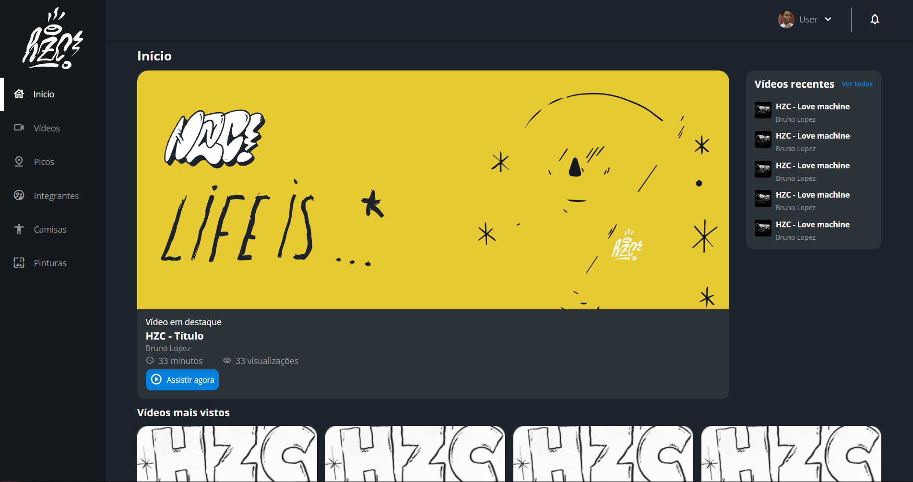

<h1>HZC</h1>

<p>Este site foi desenvolvido com pleno e total auxílio de um dos professores da Alura (Matheus Alberto)</p>

<h2>Imagem do projeto</h2>



```
projeto finalizado
```
<h3>Para acessar clique no link</h3>

>https://flex-grid-one.vercel.app/

<br>

<hr>

# Guia de estilos

Toda a estilização que será usada no projeto dentro do figma.

[Link do projeto no figma](https://www.figma.com/file/ibWktwVpnog76rMYOdVhks/Dispondo-elementos-com-flexbox-e-grid?node-id=54%3A2358)

